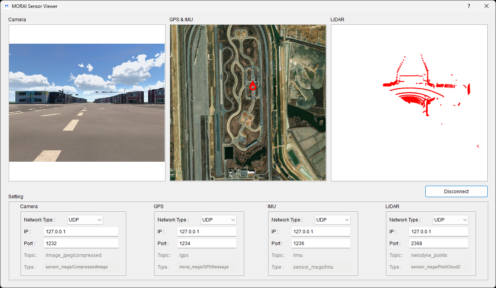

# MORAI - Virtual sensor test example

Check that your sensor models are running as intended in MORAI SIM using this test example. Stream and visualize sensor model output using a provided Python-based script. Requires beginner understanding of python environment setup.

## On ROS1

ROS1 Noetic has reached [end-of-life](https://www.ros.org/blog/noetic-eol/) and many users are migrating to ROS2. MORAI is also working to provide example code for [ROS2](https://github.com/MORAI-Autonomous/MORAI-Example-ROS2), but this is still under construction. This SensorExample project will still be available for all ROS1 users of MORAI SIM, but will not be further maintained.

## Setup requirements

### System

Our reference system for using these examples uses a Windows 10/11 PC running WSL2 with Ubuntu 20.04 installed. Note that we are using **Python 3.8** as Ubuntu 20.04 uses Python 3.8 by default. Considering Python 3.8 has also reached end-of-life, depending on when you are attempting to use this example script, you may need to use newer versions of Python.

| Windows PC | Ubuntu VM (WSL2) |
|---|---|
| Windows 10/11 | Ubuntu 20.04 (ROS Noetic) |
| Python 3.8 | Python 3.8 |

Other system options are to use two separate machines outright, or to use Docker containers. However, these options have not been tested by MORAI.

### Dependencies

This example can be run standalone when streaming data over UDP, but requires a set of custom [MORAI-specific messages](https://github.com/MORAI-Autonomous/MORAI-ROS_morai_msgs) to be installed on the ROS system. The ROS messages are included as a git submodule (in `lib/morai-ros-msgs`).

## Setup (Windows)

### Recommended: use [uv](https://github.com/astral-sh/uv)

1) Install uv (Windows PowerShell):
```powershell
irm https://astral.sh/uv/install.ps1 | iex
uv --version
```

2) Setup uv:
```powershell
uv init
```

3) Run with uv:
```powershell
uv run src\sensor_example\morai_sensor_viewer.py
```

The main runtime dependencies are listed in `requirements.txt`, but are now superseded by `uv.lock` and `pyproject.toml`:
- numpy==1.24.4
- opencv-python==4.11.0.86
- pynmea2==1.19.0
- pyside2==5.15.2.1
- pyvista>=0.44.2
- pyvistaqt>=0.11.3
- requests==2.32.4

### Alternative with pip (without uv):

```powershell
python -m venv .venv
.\.venv\Scripts\Activate.ps1
pip install -r requirements.txt
python src\sensor_example\morai_sensor_viewer.py
```

## Setup (Linux Ubuntu/ROS)

1) Download and build our custom morai_msgs for ROS1

2) Setup the project in a new install path
```bash
cd {example install path}/MORAI-SensorExample
pip install -r requirements.txt
catkin_make
source devel/setup.bash
python3 src/sensor_example/morai_sensor_viewer.py
```

## Use

Once the main script `morai_sensor_viewer.py` runs, use the UI to set the desired connection type and any relevant configurations.

Also recall that there are two different bash files that must be sourced for each terminal - one from the ROS install folder, and one from the morai_msgs install folder.
```bash
source /opt/ros/noetic/setup.bash
source ~/MORAI-SensorExample/devel/setup.bash  # change path as required
```



## Limitations and troubleshooting

This example has not been tested for robustness and may crash upon encountering different exceptions. For example, once you start a connection with the UI, switching between connection methods (from ROS to UDP and vice-versa) can lead to the script crashing.

If the UI appears unresponsive, restarting the script will resolve most sporadic issues.

There have been instances when users have difficulty running the sensor viewer due to conflicts with the Qt libraries used by the Pyside and PyVista libraries. A `starter.sh` script shows one possible solution to hard-wiring library dependencies to fix conflict issues.

## Resources

- [Website](https://www.morai.ai/)
- **Documentation**:
  - [MORAI SIM Manual (English)](https://morai-sim-drive-user-manual-en-24-r2.scrollhelp.site/morai-sim-drive-user-manual-en-24.r2/Working-version/?l=en)
  - [MORAI SIM Manual (Korean)](https://help-morai-sim.scrollhelp.site/)
- **Quickstart Guide (EN)**:
  - [ROS Environment Setup](https://morai-sim-drive-user-manual-en-24-r2.scrollhelp.site/morai-sim-drive-user-manual-en-24.r2/Working-version/quick-start-guide-for-ros)
  - [Data Sync Example](https://morai-sim-drive-user-manual-en-24-r2.scrollhelp.site/morai-sim-drive-user-manual-en-24.r2/Working-version/morai-sim-examples-ros-udp)

## License and acknowledgements

This project is licensed under the [MIT License](LICENSE).

This project also uses the following open-source libraries:

- Qt for Python (PySide2)
> - Licensed under the LGPL v3
> - Copyright (C) 2025 The Qt Company
> - Source code available at: https://wiki.qt.io/Qt_for_Python
> - You may obtain a copy of the LGPL v3 license at: https://www.gnu.org/licenses/lgpl-3.0.html